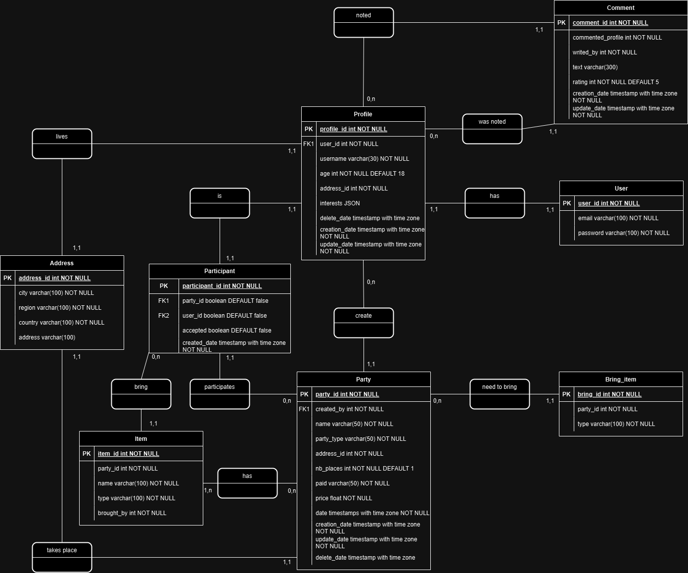
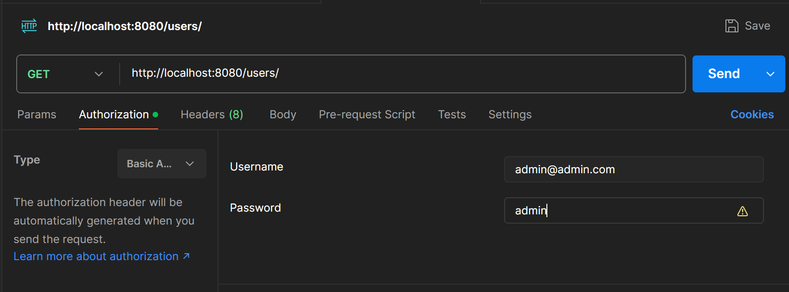

# Party

## Présentation

Party est une application de gestion d'événements sociaux, principalement axée sur l'organisation de fêtes. Elle permet de créer des événements, d'inviter des participants, de gérer les éléments nécessaires à l'organisation (comme les articles à apporter, les lieux, etc.) et d'interagir avec les profils des utilisateurs.

## Base de données

Schéma MCD

L'application utilise une base de données Postgresql.
Afin de créer celle-ci, vous devez utiliser les scripts présents dans le dossier ``src/main/resources/database``

## Connexion
Pour utiliser l'application, il faut d'abord se connecter.
Par défaut, il y a un utilisateur ``admin@admin.com`` dont le mdp est ``admin``

### Postman

Accéder à l'onglet Authorization, puis choisir le type ``Basic Auth``, ensuite il suffit de renseigner les informations ci-dessus et envoyer la requête.

## Swagger

Vous pouvez accéder à Swagger afin de tester les routes :

``http://localhost:8080/swagger-ui/index.html``